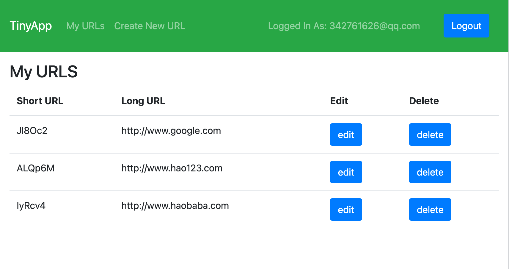
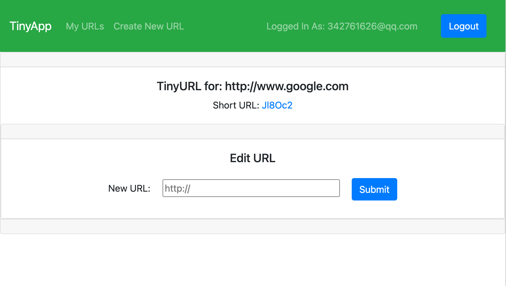

# TinyApp Project

TinyApp is a full stack web application built with Node and Express that allows users to shorten long URLs.

## Getting Started

- Install all dependencies (using the `npm install` command).
- Set up server by `npm start` command in terminal.
- In web browser (Chrome preferred) go to http://localhost:8080/urls

## Final Product

## Dependencies

- Node.js
- Express
- EJS
- bcrypt
- body-parser
- cookie-session